# 📅 Event Planning App  
**A social productivity tool that helps users create, discover, and join events with ease.**  

  
  
  
  
  
  
  

---

## ✨ Features
- 🔐 **Firebase Authentication** (Email/Password, Google Sign-In)  
- 🗺 **Google Maps Integration**: View events on a map, circles highlight event location, open directions via `url_launcher`.  
- 📍 **Location Picker** when creating/editing events.  
- 🌙 **Light & Dark Themes**.  
- 🌍 **Localization** (English 🇺🇸 & Arabic 🇪🇬).  
- 🗂 **Event Categories & Filters** to quickly find events.  
- ⭐ **Favorites Tab** to save important events.  
- ❤️ **Smooth UX** with onboarding, splash screen, and polished UI.  

---

## 🛠 Tech Stack
- **Frontend**: Flutter  
- **Backend**: Firebase (Auth, Firestore)  
- **State Management**: Provider + MVVM  
- **Maps**: Google Maps API  
- **Packages**:  
  - `firebase_auth`, `cloud_firestore`, `firebase_core`  
  - `google_sign_in`, `google_maps_flutter`, `geolocator`, `geocoding`  
  - `provider`, `intl`, `flutter_localizations`  
  - `introduction_screen`, `url_launcher`, `toggle_switch`  
  - `flutter_local_notifications`, `firebase_messaging` (future use)  

---

## 📲 App Flow
The app flow is designed for a **smooth user journey**:  

1. **Splash Screen** → quick branding and initialization  
2. **Onboarding** → introduce features & productivity workflow  
3. **Login / Register** → Firebase Auth + Google Sign-In  
4. **Home (Tabbed Layout)**  
   - 🏠 **Home Tab** → Events feed, filter by category  
   - 🗺 **Map Tab** → Explore events visually on map  
   - ⭐ **Favorites Tab** → Saved events  
   - 👤 **Profile Tab** → User info, settings  
5. **Add Event Screen** → Create a new event with title, description, category, date, location  
6. **Event Details Screen** → Full details + view on map + option to favorite  
7. **Edit Event Screen** → Update details and location  

---

## 📸 Screenshots
⚡ *UI polished for light/dark mode & EN/AR localization.*  

### 🌞 Light Mode (EN) – Full Walkthrough
| Let's go | Onboarding | Login | Register |
|----------|-------------|-------|----------|
|  |  | 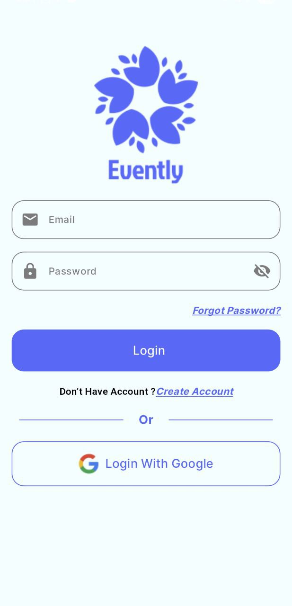 | 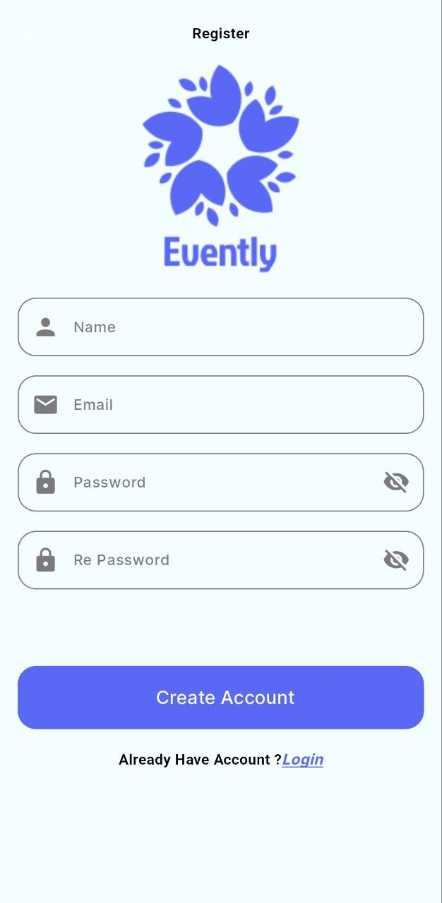 |


| Home Tab | Map Tab | Favorites Tab | Profile Tab |
|----------|---------|---------------|-------------|
| 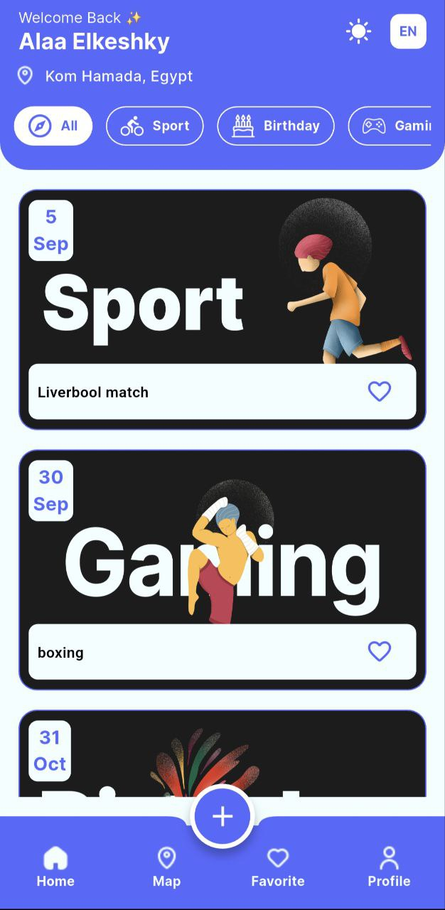 | 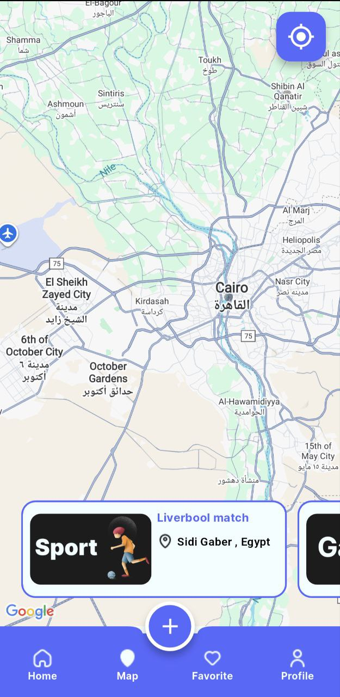 | 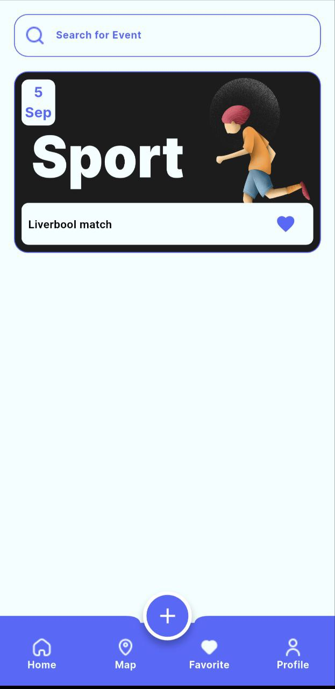 | 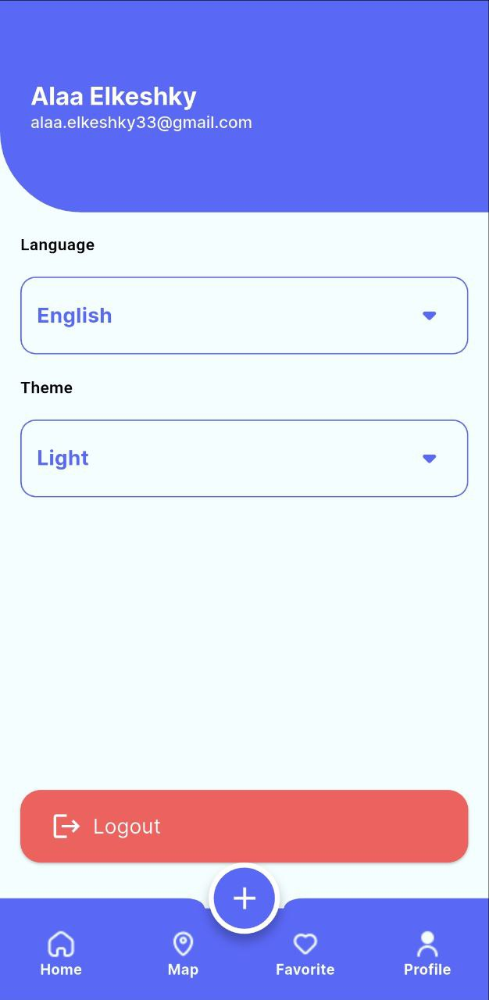 |

| Add Event | Event Details | Edit Event | Location Picker |
|-----------|---------------|------------|-----------------|
|  | 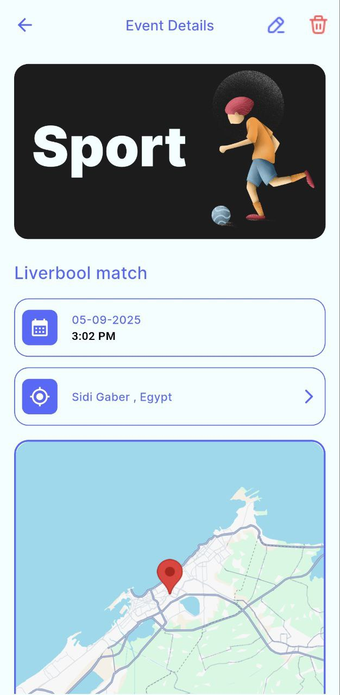 | 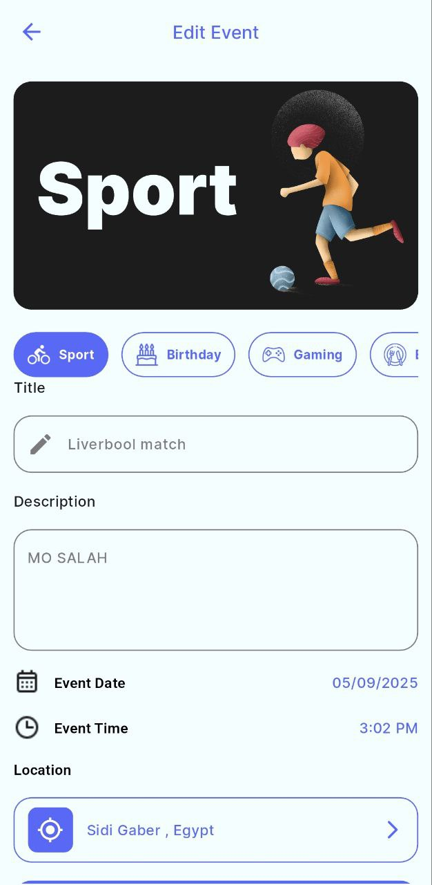 | 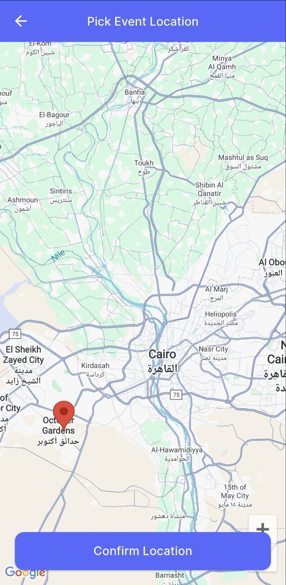 |


---

### 🌚 Dark Mode (EN)
| Home | Map | Profile |
|------|-----|---------|
| 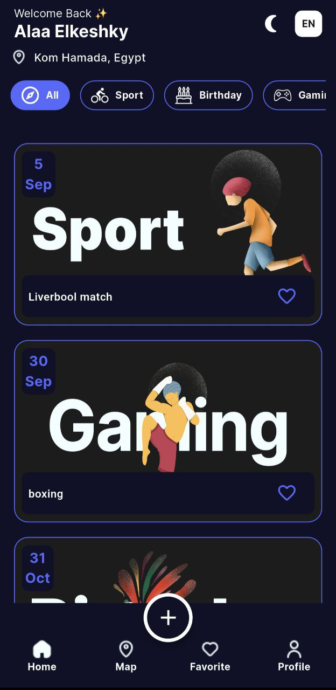 | 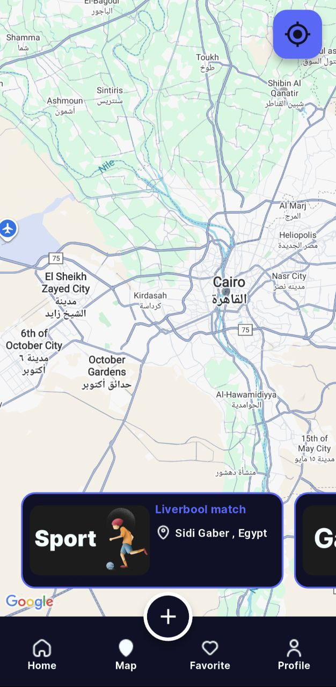 | 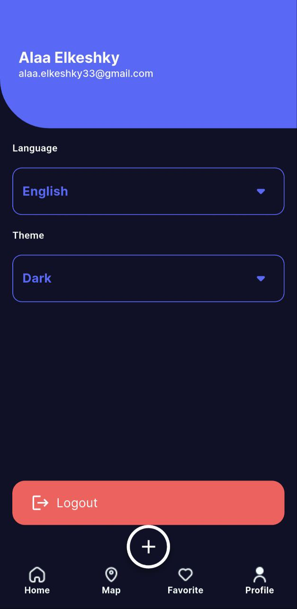 |

---

### 🌍 Arabic (AR)
| Home (AR) | Profile (AR) | Event Details (AR) |
|-----------|----------|--------------|
| 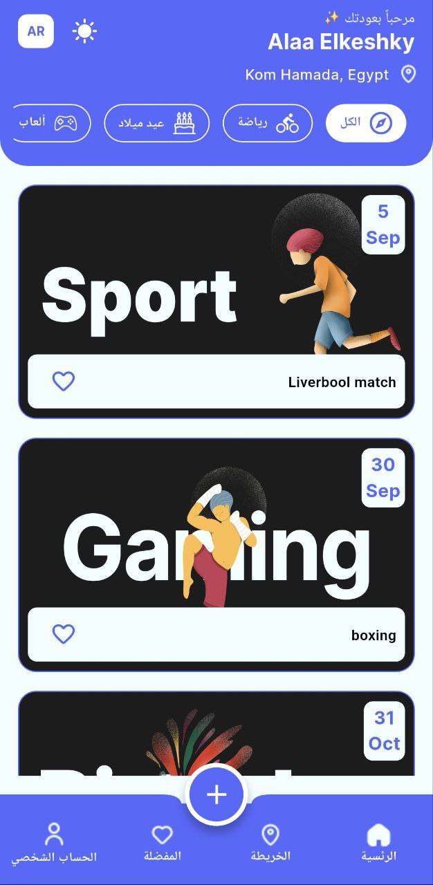 | 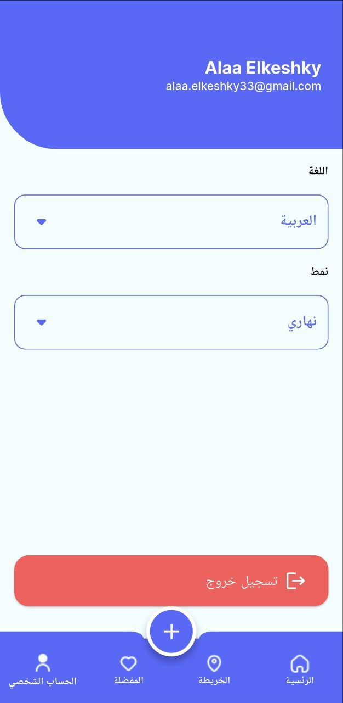 |  |

---

## 🏗 Architecture
The app follows **MVVM (Model–View–ViewModel)** with **Provider** for clean and maintainable state management.  

- **Model** → Event, User data (from Firestore).  
- **View** → Flutter UI screens (Home, Map, Profile, etc.).  
- **ViewModel** → Handles business logic, communicates with Firebase, updates Providers.  

This ensures **separation of concerns** and easy scalability.  

---

## 🚀 How to Run
1. Clone the repo  
   ```bash
   git clone https://github.com/your-username/event-planning-app.git
   cd event-planning-app
    ```
2. Install dependencies
    ```bash
    flutter pub get
   ```
3. Configure Firebase
   - Add `google-services.json` for Android
    - Add `GoogleService-Info.plist` for iOS 
4.  Run the app
     ```bash
     flutter run
     ```
---

## 📌 About  

This project was built to showcase:  

- **Firebase integration in Flutter**  
- **Clean Architecture with MVVM**  
- **Professional app design** (themes, localization, maps, authentication)  
   
---
  
